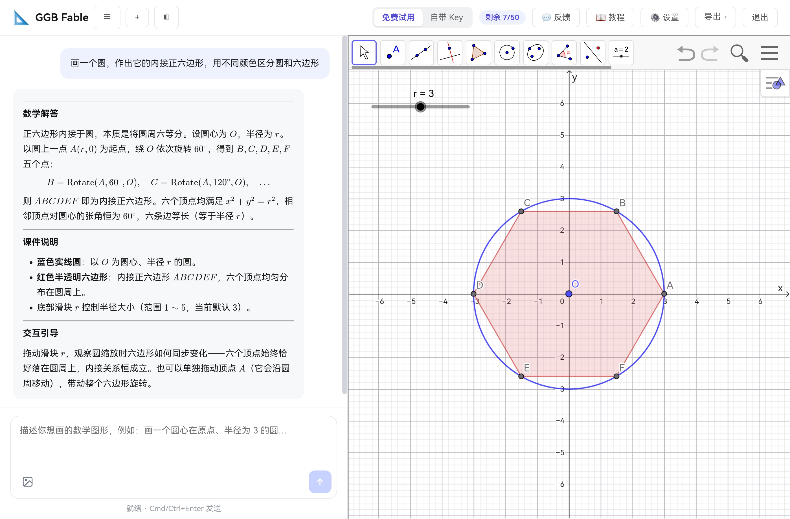
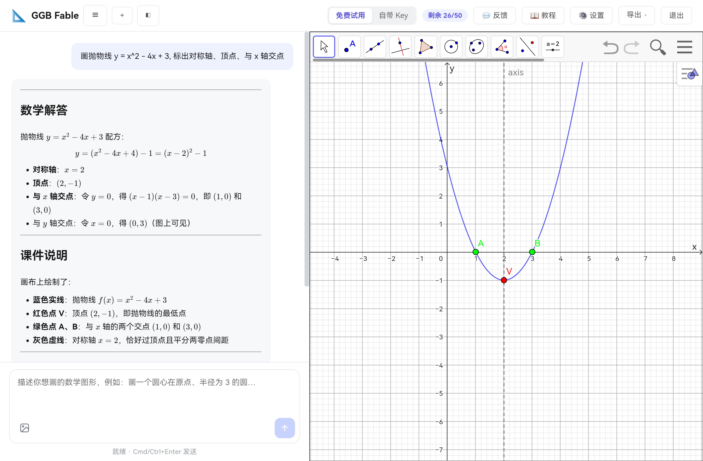
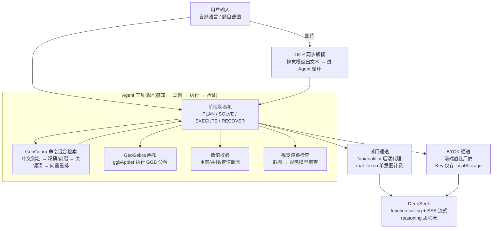

# GGB Fable · 用一句话画出可探究的数学图形

[](https://ggbfable.nanobanano.online)


> GGB Fable (ggbfable) is a free AI-powered GeoGebra canvas assistant for K12 math education — describe a figure in natural language and get an interactive, draggable construction. [Try it online](https://ggbfable.nanobanano.online).

**GGB Fable(ggbfable / ggb-fable)** 是一个面向 K12 数学教育的 GeoGebra AI 画布助手:用自然语言描述想要的图形,AI 自动在 GeoGebra 画布上构造出**可拖动、可探究**的动态课件——不是静态图,而是带滑动条、轨迹、动画的活图形。

**免费 · 源码公开 · 在线可用**:邮箱注册即享 5 次免费生成;配置自己的 API Key(BYOK)后无限使用。

- 🌐 在线试用:<https://ggbfable.nanobanano.online>
- 🧩 技术栈:Next.js 15 · React 19 · TypeScript · Supabase · Vercel Edge
- 🤖 模型:DeepSeek(对话 + 工具调用)· GLM(向量检索 + 视觉 OCR)

---

## 🎬 效果演示

<table>
  <tr>
    <td width="50%" align="center"><br /><sub><b>尺规作图 · 圆的内接正六边形</b></sub></td>
    <td width="50%" align="center"><br /><sub><b>二次函数 · 自动求顶点/对称轴/零点</b></sub></td>
  </tr>
  <tr>
    <td width="50%" align="center"><video src="public/demos/rolling-circle.mp4" controls muted width="100%"></video><br /><sub><b>圆沿 x 轴滚动一周,验证周长 C = 2πr</b>(<a href="public/demos/rolling-circle.mp4">视频直链</a>)</sub></td>
    <td width="50%" align="center"><video src="public/demos/helix-cone.mp4" controls muted width="100%"></video><br /><sub><b>3D · 动点沿圆锥表面螺旋上升</b>(<a href="public/demos/helix-cone.mp4">视频直链</a>)</sub></td>
  </tr>
</table>

## 🚀 快速开始(在线版)

1. 打开 <https://ggbfable.nanobanano.online>
2. 输入邮箱,收 Magic Link 邮件点一下即登录(注册即送 5 次免费生成)
3. 在输入框用一句话描述需求,例如:
   - 「画一个圆的内接正六边形,展示尺规作图过程」
   - 「画二次函数 y=ax²+bx+c,用滑动条调 a/b/c,自动标出顶点和对称轴」
   - 「证明勾股定理:直角三角形三边上作正方形,面积可测量」

也可以**支持图片输入**:上传题目截图(或拍照),视觉模型 OCR 识别后直接作图。用完免费额度后,在设置页填入自己的 DeepSeek/GLM API Key 即可无限使用——**Key 仅存浏览器 localStorage,永不上传服务器**。

## ✨ 核心特性

| 特性 | 说明 |
|---|---|
| 🎨 一句话生成动态课件 | 自然语言 → GeoGebra 构造,滑动条/轨迹/动画齐全,可拖动探究 |
| 🖼️ 拍题即画 | 截图/照片上传 → 视觉模型 OCR → 直接构造,题目文字不用手敲 |
| 🔍 命令智能检索 | 内置 509 条 GeoGebra 官方命令 + 手工中文别名/陷阱注记,四级混合检索精准召回 |
| ✅ 数值关系校验 | Agent 主动验证垂直/共线/定值等几何约束,构造错误可被发现和修复 |
| 👁️ 视觉渲染检查 | 生成后截图交视觉模型审查标签遮挡、辅助线型、角弧方向,闭合"画得满不满意"最后一环 |
| 💬 多轮对话迭代 | "把颜色改红""加一条虚线辅助线"——会话云端持久化,可生成分享链接 |
| 🔑 BYOK 隐私友好 | 自带 Key 模式下前端直连厂商,额度无限且密钥不出浏览器 |

## 🏗️ 系统架构



### Agent 工具循环

核心是「感知 → 规划 → 执行 → 验证」的闭环(`lib/agent.ts`),设计参考了 GeoChat 与 Draw2Think 验证过的模式,系统提示词与工具定义经过几十轮真实用例打磨,并做了版本化(`prompts/v1.md` → `v2.md`)管理,可在管理后台热切换。

- **阶段状态机**:每轮循环处于 `PLAN / SOLVE / EXECUTE / RECOVER` 之一,前端状态行实时展示当前阶段与进度
- **思考流**:DeepSeek `reasoning_content` 增量流式透传,用户能看到模型"正在怎么想"
- **预算控制**:单意图最多 30 轮工具调用 / 100k 输入 token 的软上限,防止循环失控;历史消息自动压缩(`loop-context.ts`),长任务不爆上下文
- **可中断**:`turn-interrupt.ts` 支持生成中途打断,即时回收控制权
- **失败恢复**:命令执行报错进入 RECOVER 阶段,模型读错误信息自行修正

### 命令混合检索(`lib/command-search.ts`)

LLM 记不全几百条 GeoGebra 命令的参数签名,检索质量直接决定构造正确率:

1. **中文别名层**——手工整理「角平分线 → AngleBisector」等映射 + 陷阱注记
2. **精确 / 前缀匹配**
3. **关键词匹配**
4. **向量语义重排**——GLM embedding-3(1024 维),509 条命令的向量**预计算后提交进仓库**,命中即零 API 成本;换模型则 IndexedDB 持久化,每个配置只算一次

### 双通道密钥与计费

| 模式 | Key 位置 | 请求路径 | 计费 |
|---|---|---|---|
| 免费试用 | 服务端(环境变量注入) | `/api/trial/llm` 后端代理 | trial_token 签名防滥用:**单意图多轮工具调用只扣 1 次**,token 15 分钟过期 |
| 自带 Key(BYOK) | 用户浏览器 localStorage | 前端直连厂商 | 不计额度,Key 永不上传 |

安全边界:Supabase 全表 RLS 行级隔离;`service_role` key 只在后端;试用通道有防失控软上限;敏感配置(`.env.local`、`models.local.json`)全部 gitignore。

### 数据模型(Supabase)

`profiles`(用户/管理员)· `usage`(额度)· `sessions` / `messages`(会话云端持久化)· `feedback`(反馈)· `app_config`(prompt 版本等运行时配置),配合 SQL RPC 做原子扣减。

## 📐 质量保障:画布生成 Eval 体系(`eval/`)

做 AI 应用最难的不是"能跑",而是"改了 prompt 之后不知道变好还是变坏"。为此建了一套**回归驱动的画布生成评测**:

- **零 LLM 判分**:所有断言都是确定性代码,不靠模型当裁判。10 种断言原语:`object_exists` / `measure_eq`(数值关系)/ `slider_exists` / `parametric_ref` / `visual_inspect_ok` / `process_no_error` / `process_budget` …
- **真实浏览器驱动**:Playwright 起真实页面,端到端跑完"输入 → 生成 → 画布检查"
- **用例 JSON 化 + 变体机制**:`eval/cases/` 按桶分类(basics / functions / dynamic / multi / traps),`--variant` 切模型/prompt 配置
- **基线对比矩阵**:改 prompt 或换模型后 `--compare` 旧结果,输出 variant × category 对比矩阵
- **每用例 3 次采样**取多数决,区分"不稳定"与"全坏"

**当前基线数据**(deepseek + prompt v2,10 用例 × 3 采样):

| 桶 | 成功率 | 说明 |
|---|---|---|
| 基础构造 basics | 100% | |
| 函数图像 functions | 100% | |
| 动态可拖动 dynamic | 100% | |
| 多步组合 multi | 100% | 如三角形内心的多步构造 |
| 陷阱与预算边界 traps | 50% | 幻觉命令/预算耗尽场景,持续迭代重点 |
| **总计** | **90%** (9/10) | |

基于这套度量做了**三臂 A/B 实验**(`docs/eval-report-speed-ab.md`)量化思考模式取舍:思考全开 90% 但 budget 用例 P50 248s,思考关闭 80%、P50 86s——质量 +10pp 换延迟 ≈ 3×,每个决策都有数据可依,且实验臂未达预设质量门时按决策纪律拒绝上线(STOP)。

> 设计 spec、实施计划、eval 报告全部留档在 `docs/`,完整呈现"规格 → 计划 → 实现 → 度量 → 迭代"的工程流程。

## 🛠️ 本地运行

```bash
pnpm install
cp .env.local.example .env.local   # 填入 Supabase / DeepSeek / GLM 的 key(见文件内注释)
pnpm dev                           # http://localhost:3000
```

```bash
pnpm typecheck    # TS 检查
pnpm test         # vitest 单测(Agent 循环/上下文压缩/中断/重试等)
pnpm eval -- --list                       # 列出 eval 用例
pnpm eval -- --case <用例> --runs 1       # 单用例冒烟(需先 pnpm dev)
```

部署到 Vercel 的完整步骤(含 Supabase 配置、管理员设置、上线验证清单)见 [DEPLOY.md](DEPLOY.md)。

## 📁 项目结构

```
├─ app/              # Next.js App Router:页面(落地页/工作台/登录/设置/分享) + API 路由
│   └─ api/          # trial(BYOK/试用代理) · auth · sessions · share · feedback · admin
├─ components/       # ChatApp(工作台主体) · OnboardingTour(新手引导) · TracePanel(过程回放)
├─ lib/              # 核心逻辑:agent(工具循环) · command-search(混合检索) · llm/vision · trial_token
├─ hooks/            # useGeogebra(画布生命周期) · useOnboarding
├─ eval/             # 画布生成质量评测:cases / variants / fixtures / scripts
├─ prompts/          # 系统提示词版本化(v1 / v2)
├─ supabase/         # schema.sql:建表 + RLS + RPC
├─ public/knowledge/ # 509 条 GeoGebra 命令签名 + 预计算向量(提交在仓库,零 API 成本)
└─ docs/             # 设计 spec · 实施计划 · eval 报告(全流程留档)
```

## 🧰 技术栈

| 层 | 选型 |
|---|---|
| 前端 | Next.js 15(App Router)· React 19 · TypeScript · zustand · KaTeX |
| 画布 | GeoGebra Web DeployedApp(ggbApplet API) |
| 后端 | Next.js API Routes(Vercel Edge)· Supabase(Auth Magic Link + Postgres + RLS + RPC) |
| 模型 | DeepSeek(对话/工具调用,SSE 流式)· GLM embedding-3(向量检索)· GLM 视觉(OCR + 渲染检查) |
| 质量 | vitest · Playwright(浏览器自动化)· 自建确定性 eval 体系 |

---

GGB Fable · 让每个孩子都能玩转数学图形 📐

<sub>搜索别名:ggbfable · GGBFable · ggbFable · ggb-fable — GeoGebra AI 画布 · AI 生成数学课件 · K12 数学动态演示</sub>
